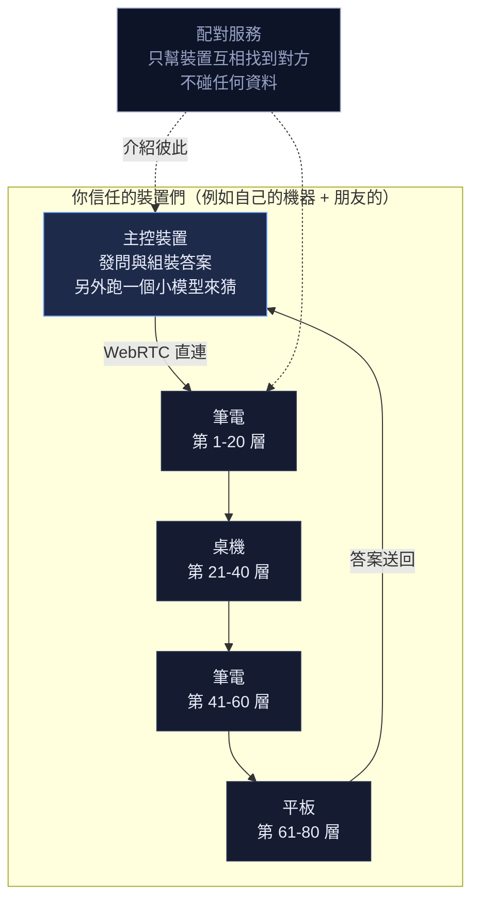
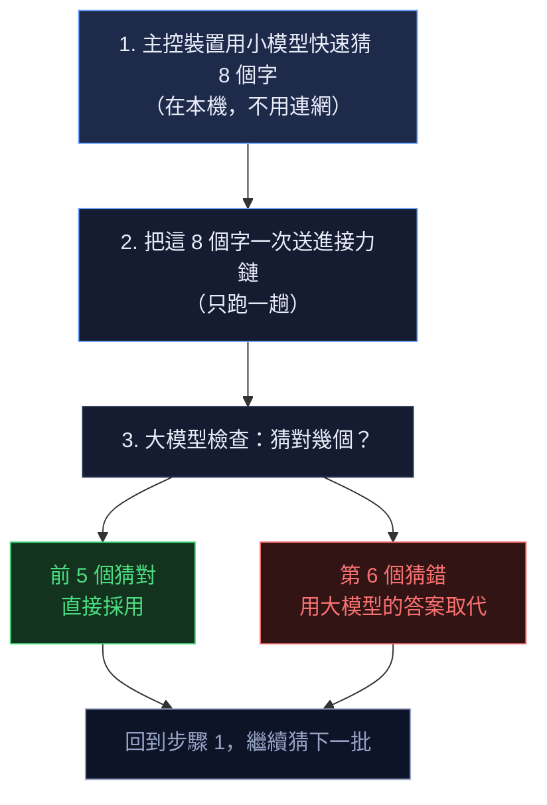

# EdgeCascadeLLM

> 把一個太大的 AI 模型拆到好幾台裝置上一起跑。

最強的開源語言模型需要 **35 GB** 記憶體。你的筆電沒有，手機更沒有。
但如果三五台裝置各出一點，湊起來就夠了。

這個專案試的就是這件事：**把模型切成幾段，一台裝置只負責其中幾層，接力算完。**

---

## 這在解決什麼問題

大型語言模型是由很多「層」堆起來的。你的問題從第一層流到最後一層，才會產生答案。
層越多，模型越聰明，但也越佔記憶體。

一個 700 億參數的模型，壓縮過後還是要 35 GB。
那超過幾乎所有消費級裝置的上限 —— 你只能買更貴的機器，或付錢用雲端。

**這個專案提供第三條路**：既然一台裝置放不下整個模型，那就每台放一部分。


**關鍵在於：裝置之間傳的不是模型本身，而是「算到一半的中間結果」。**

那只有幾十 KB，一般網路就傳得動。
模型權重只要下載一次就存在本機，之後都不用再傳。

---

## 實際的網路長什麼樣子



裝置之間是**直接連線**的（WebRTC），資料不經過中央伺服器。
配對服務只做一件事：幫兩台裝置互相找到對方，像交換電話號碼一樣。

> ⚠️ 但**不是完全沒有伺服器**。有些網路環境下裝置無法直連，
> 必須透過中繼站轉送。我們不會假裝這一點不存在。

---

## 為什麼需要「猜」

把模型拆開有一個代價：**每產生一個字，資料都要跑完整條接力**。
如果有 8 台裝置、每次交接要 50 毫秒，那產生一個字就要花將近半秒。太慢了。

解法是讓主控裝置**先用一個小模型猜幾個字**，再把這幾個字**一次送進接力鏈驗證**：



**猜錯也沒關係** —— 猜錯的部分會被大模型的正確答案取代，
所以最後品質和「一個字一個字慢慢算」是一樣的。猜對就賺到，一趟接力產出好幾個字。

這個技巧叫**投機解碼**（speculative decoding），是既有的成熟技術，不是我們發明的。

---

## 老實說的限制

| 限制 | 說明 |
|---|---|
| **比單機慢** | 如果你的裝置本來就塞得下模型，自己跑一定比較快。這個專案是為了跑**本來完全跑不動**的模型。 |
| **沒有隱私保護** | 中間結果有可能被反推出你問了什麼。目前只適合用在**你信任的裝置之間**。 |
| **不是完全去中心化** | 有些網路環境需要中繼伺服器才連得起來。 |
| **第一次很慢** | 每台裝置要先下載自己負責的那幾層，可能要十幾分鐘。之後有快取就快了。 |
| **還在驗證階段** | 核心假設都驗證過了，多裝置連線做完一半：裝置之間要傳的**資料格式與打包方式**已經完成並測過，但**實際的連線還沒接上**。 |

前輩專案 [Petals](https://petals.dev/) 已經證明這條路技術上可行，
但它的公開網路現在幾乎沒人用了。
**真正的難題不是技術，是找不找得到夠多人一起跑。**
所以我們刻意從「自己的幾台裝置」這種小規模開始，而不是一開始就做公開網路。

---

## 目前進度

| 階段 | 在問什麼 | 狀態 |
|---|---|---|
| M0 | 這樣做理論上跑多快？ | ✅ 完成 |
| M1 | 把模型切開，結果還對嗎？ | ✅ **完成，結果完全正確** |
| M4 | 壓縮中間結果會不會失真？ | ✅ 完成，找到可用的壓縮方式 |
| M2 | 在瀏覽器裡跑得起來嗎？ | ✅ 完成，且可部署。已有真實裝置實測數據 |
| M3 | 多台裝置真的連起來 | 🔨 **進行中** —— 資料格式與打包層完成，連線還沒接 |
| M5 | 記住算過的東西 + 加上「猜字」加速 | ⬜ 還沒做 |
| M6–M7 | 自動配對、斷線接手 | ⬜ 還沒做 |

**幾個已經驗證的結果：**

- 把模型切成 2、4、8、15 段，算出來的結果**完全一樣** —— 切分本身不會讓模型變笨
- 中間結果可以壓到約 1/3 大小，品質只掉 **0.03%**
- 但壓縮方法要選對：用錯的方法會讓模型直接壞掉（困惑度從 13.8 暴增到 4208）
- 權重量化到 8-bit 沒問題，但 **4-bit 會讓這個 135M 小模型壞掉**
  （選字正確率從 15/16 掉到 3/16）—— 小模型對低位元特別敏感
- 真實裝置（筆電內顯）跑得起來，顯示卡的記憶體上限也比預期寬鬆很多
- **算第一個字要 35.5 毫秒，但之後每多算一個字只要 4.2 毫秒。**
  所以「一次猜 8 個字再一起驗證」只花單一個字的 1.7 倍時間 ——
  這正是「猜字」那一招能成立的原因
- 用兩種不同的執行方式（WASM 與 WebGPU）算同一個模型，
  差異小到不影響選字。代表不同裝置混用不同方式是可以的
- 但也發現一件重要的事：**測試用的小模型太小了**，時間幾乎都花在
  「叫顯示卡做事」的固定開銷上，不是真的在算。
  所以那台機器量到的速度數字**不能拿來推估大模型**——
  我們把這一點明確寫在報告和文件裡，而不是拿一個好看的數字含混過去
- **裝置之間要傳什麼、長什麼樣子，已經定案並實作完成**：
  每則訊息的格式、怎麼切成小塊送、怎麼避免一次塞太多把連線弄斷
- **修正了一個漏算。** 原本以為壓縮後每個數值只要 8.24 bits，實際是 10.24。
  因為壓縮要用到一張「刻度表」（每個數值要除以多少才縮得進小格子），
  而那張表是看當下這批資料算出來的，對方推不出來、只能跟著一起傳 ——
  之前只算了資料本身。重算之後，連「哪一種壓縮法比較省」的結論都反過來了
- **測試自己也有盲點。** 我們把訊息裡兩個欄位的位置對調，16 個測試依然全綠 ——
  因為它們只證明了「我寫出去的跟我讀回來的一致」，沒證明「符合規格」。
  而規格存在的唯一理由，就是讓別人寫的程式也讀得懂。
  現在改成**故意把程式改壞、看測試會不會變紅**來檢查測試本身有沒有用

---

## 你可以幫的忙

我們需要知道各種真實裝置跑起來是什麼樣子 —— 手機、筆電、不同的顯示卡。
開發環境裡沒有顯示卡，這些數字量不到。

**開啟量測頁面，按兩個按鈕，把結果貼回來就好。**
全程在你的瀏覽器裡執行，不會上傳任何東西。

> 如果你的電腦有兩張顯示卡（例如內建顯卡 + NVIDIA），多半只會偵測到內建的那張。
> 這不是漏掉了 —— Chrome 一次只用得到一張，而且預設挑省電的。
> 想改用獨立顯卡，做法見[部署指南的顯示卡一節](docs/DEPLOY.md)。

**再往後一步會需要另一種幫忙。** 多裝置連線接好之後，
我們需要有**兩台裝置、而且能連上同一個 Wi-Fi** 的人幫忙跑一次 ——
開兩個網頁、互相貼一段文字就連起來了，不需要伺服器、不需要設定任何東西。
那一步還沒到，現階段先以量測頁為主。

---

## 自己跑跑看

> **Windows 使用者**：`cd web` 之後那幾行 npm 指令跨平台完全一樣，
> 會自己找到你機器上的 Python，你不用打任何 Python 指令。
> 其餘的請把 `python3` 換成 `python`、`.venv/bin/python` 換成
> `.venv\Scripts\python`。
> 遇到「Device Guard 封鎖」或「Python was not found」的訊息，
> 詳見[部署指南的 Windows 一節](docs/DEPLOY.md)。

```bash
# 這兩個不用下載任何東西，純數學
python3 bench/model.py --model 32b --nodes 4   # 估算效能
python3 bench/wire_size.py                     # 各種壓縮法的真實傳輸成本

# 在瀏覽器裡跑 / 部署到 Cloudflare
cd web
npm ci
npm run setup    # 建 .venv 並裝 Python 套件（不會動到系統 Python）
npm run dev      # 開 http://localhost:8080 自己玩
npm test         # 用 headless 瀏覽器驗證整條流水線
npm run deploy   # 建置 + 產生模型 + 部署（不需要付款方式）
cd ..

# 驗證「把模型切開結果還對嗎」（要先跑過上面的 npm run setup）
.venv/bin/python spike/export_shards.py --model HuggingFaceTB/SmolLM2-135M \
        --shards 4 --dtype int4 --out out/ --seed 42
.venv/bin/python spike/verify_shards.py --dir out/
```

> **不要直接 `pip install torch`。** 用上面的 `.venv` 路徑，
> 或在 Windows 上用 `.venv\Scripts\python`。
> 直接對系統的 Python 裝 torch，會把你原本可能裝著的 **CUDA 版換成 CPU 版** ——
> 這個 repo 真的害人踩過一次，連帶弄壞了依賴它的其他套件。
> `npm run setup` 建的 `.venv` 是隔離的，動不到你其他專案。
> 詳見[部署指南](docs/DEPLOY.md)。

---

## 技術文件

這份 README 刻意寫得淺，完整的技術內容在 `docs/`：

| 文件 | 內容 |
|---|---|
| [部署指南](docs/DEPLOY.md) | 怎麼部署到 Cloudflare Workers（免付款方式） |
| [可行性評估](docs/00-feasibility.md) | 量化模型、實測數據、困難點清單 |
| [架構規格](docs/01-architecture.md) | 解碼協定、frame 格式（位元組層級）、容錯設計 |
| [開發路線](docs/02-roadmap.md) | 里程碑與驗收條件 |
| [待答問題](docs/03-open-questions.md) | 已知的未知數 |

---

## 授權

見 [LICENSE](LICENSE)。
